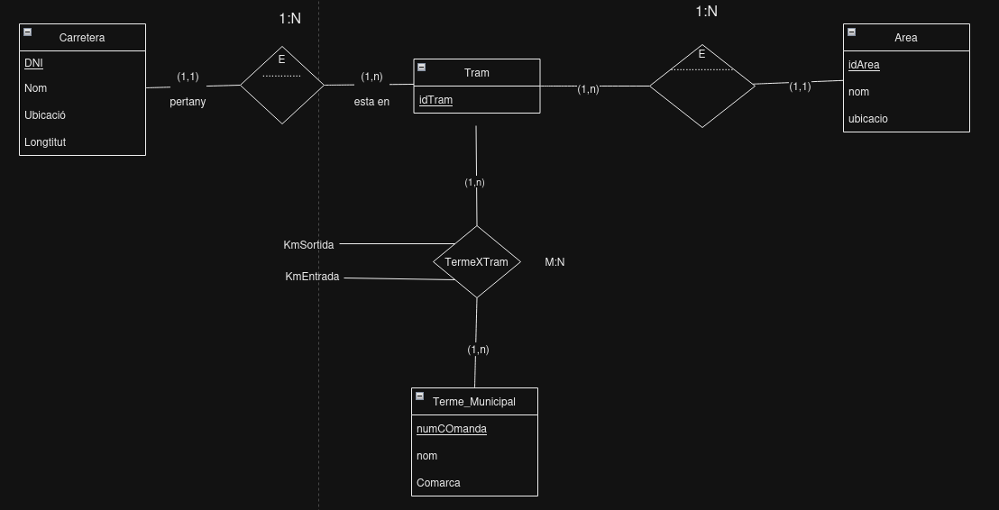

# 4. Carreteres

Dissenyar una base de dades que contingui informació relativa a totes les carreteres d'un determinat país. Es demana realitzar el disseny en el model E/R, sabent que:

En aquest paıs les carreteres es troben dividides en trams.

Un tram sempre pertany a una única carretera i no pot canviar de carretera.

Un tram pot passar per diversos termes municipals, sent una dada d'interès al km. del tram pel qual entra en dit terme municipal i al km. pel qual surt.

Hi ha una sèrie d'àrees en les que s'agrupen els trams, cada un dels quals no pot pertànyer a més d'una àrea.

# 2. Model conceptual
## 2.1. Enllaç públic a l'esquema
[Esquema drawio -- Carreteres](https://drive.google.com/file/d/1GeiRzchkdfd39JPHk69qGR18ehFh-rDj/view?usp=sharing)
## 2.2. Esquema conceptual (EC ó ER)
  
# 3. Model lògic relacional
## 3.1. Esquema lògic
  Tram (<ins>IdTram</ins>, Nom, KilometreSortida, *IdCarretera*, *IdArea*)\
  Carretera (<ins>IdCarretera</ins>, Nom, Ubicació, Longitut)\
  Area (<ins>IdArea</ins>, Nom, Ubicació)\
  Terme_Municipal (<ins>IdTerme</ins>, Nom, Comarca)\
  TermeXTram (<ins>IdTram,IdTerme</ins>, KmEntrada, KmSortida)

## 3.2. Diagrama referencial

* El diagrama referencial em serveix per indicar quines claus alienes hi ha a l'esquema lògic  
* La relació referencial és aquella que conté la clau aliena  
* La relació referida és l'origen de la informació. És la part 1, tal com s'ha explicat a classe.

Relació referencial|Clau aliena|Relació referida
-|:-:|-
Tram|IdCarretera|Carretera
Tram|IdArea|Area
TermeXTram|IdTram|Tram
TermeXTram|IdTerme|Terme_Municipal

# 4. Model físic
## 4.1 Enllaç a l'esquema físic

[NONE](./)
