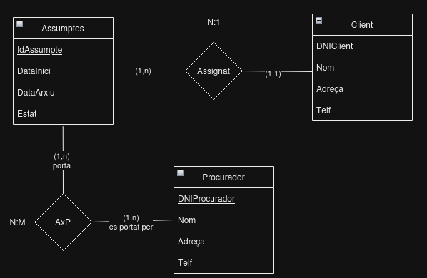

# 1. Gabinet d'Adbocats

Es vol dissenyar una base de dades relacional per a emmagatzemar informació
sobre els assumptes que porta un gabinet d'advocats.

Cada assumpte té un número d'expedient que l'identifica i correspon a un sol
client.

De l'assumpte s'ha d'emmagatzemar la data d'inici, data d'arxiu (finalització)
, el seu estat (en tràmit, arxivat, etc), així com les dades personals del
client al qual pertany (DNI, nom, adreça, telèfon).

Alguns assumptes són portats per un o diversos procuradors i viceversa, dels
quals ens interessa també les dades personals (DNI, nom, adreça, telèfon).

# 2. Model conceptual
## 2.1. Enllaç públic a l'esquema
[Esquema drawio -- Gabinet d'Adbocats](https://drive.google.com/file/d/19jyyxrT2YkxDXFEycAip-f08-r8KN9k3/view?usp=sharing)
## 2.2. Esquema conceptual (EC ó ER)
  
# 3. Model lògic relacional
## 3.1. Esquema lògic
  Client (<ins>DNIClient</ins>, Nom, Adreça, Telf)\
  Asumptes (<ins>IdAssumpte</ins>, DataInici, DataArxiu, Estat, *DNIClient*)\
  Procurador (<ins>DNIProcurador</ins>, Nom, Adreça, Telf)\
  AssumptesProcurador (<ins>IdAssumpte,DNIProcurador</ins>)

## 3.2. Diagrama referencial

* El diagrama referencial em serveix per indicar quines claus alienes hi ha a l'esquema lògic  
* La relació referencial és aquella que conté la clau aliena  
* La relació referida és l'origen de la informació. És la part 1, tal com s'ha explicat a classe.

Relació referencial|Clau aliena|Relació referida
-|:-:|-
Assumptes|IdClient|Client
AssumptesProcurador|DniProcurador|Procurador
AssumptesProcurador|IdAssumpte|Assumptes

# 4. Model físic
## 4.1 Enllaç a l'esquema físic

[SCRIPT DE SQL GABINET](./1_gabinet.sql)
