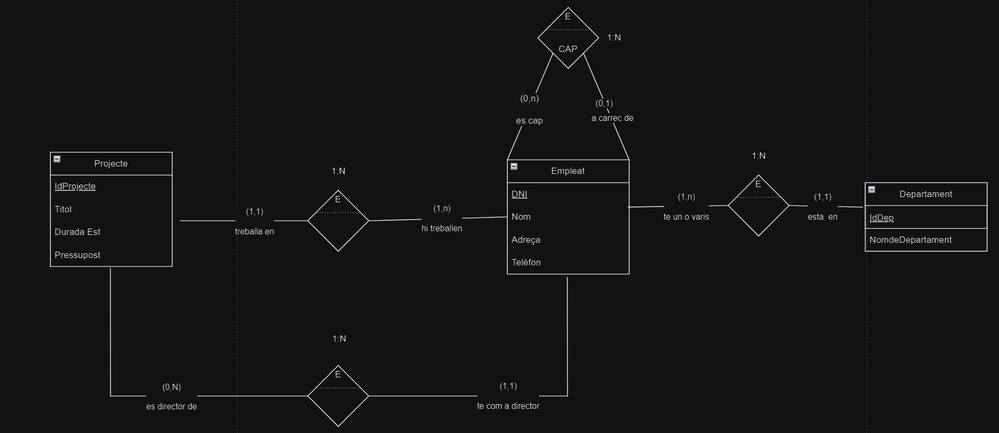

# 3. Gestió de projectes

Es desitja dissenyar una base de dades que reculli la informació sobre la gestió de projectes que es porta a terme a l'empresa i la participació dels empleats. De cada empleat necessitarem saber el seu DNI, nom, adreça, telèfon i projecte en el qual participa. Cada projecte s'identificarà per un codi que serà únic, tindrà un títol, una durada estimada, una durada real, un pressupost.

De cada projecte es vol saber qui és l'empleat director del projecte. A vegades passa que la mateixa persona pot dirigir diferents projectes.

Cada empleat està assignat a un únic departament que s'encarregarà d'unes tasques determinades dins de l'empresa. Del departament de vol conèixer el nom.

Es vol saber de cada empleat qui és el seu cap en cas que el tingui. Modificar l'esquema anterior per recollir els nous requeriments d'usuari (aquest requeriment no l'he explicat a classe però el teniu explicat als apunts).

# 2. Model conceptual
## 2.1. Enllaç públic a l'esquema
[Esquema drawio -- Gestió de projectes](https://drive.google.com/file/d/18g6ZD8ETcR28acJJXo2y9Pp55QCoQghV/view?usp=sharing)
## 2.2. Esquema conceptual (EC ó ER)
  
# 3. Model lògic relacional
## 3.1. Esquema lògic
  Empleat (<ins>DNI</ins>, Nom, Adreça, Telf, *CodCAP*, *IdProjecte*, *IdDepartament*)\
  Projecte (<ins>IdProjecte</ins>, Titol, DuradaEst, Pressupost, *DNI*)\
  Departament (<ins>IdDepartament</ins>, NomdeDepartament)

  
## 3.2. Diagrama referencial

* El diagrama referencial em serveix per indicar quines claus alienes hi ha a l'esquema lògic  
* La relació referencial és aquella que conté la clau aliena  
* La relació referida és l'origen de la informació. És la part 1, tal com s'ha explicat a classe.

Relació referencial|Clau aliena|Relació referida
-|:-:|-
Empleat|IdProjecte|Projecte
Empleat|IdDepartament|Departament
Empleat|CodCAP|Empleat
Projecte|DNI|Empleat

# 4. Model físic
## 4.1 Enllaç a l'esquema físic

[NONE](./)
