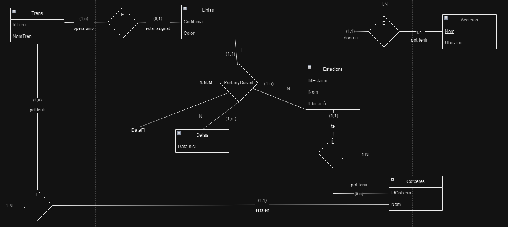

# 5. Metro
Es demana implementar el model E/R que reflecteixi tota la informació necessària per a la gestió de les línies de metro d'una determinada ciutat. Els supòsits semàntics considerats són els següents:

Una línia està composta per una sèrie d'estacions. De la línia volem saber el codi (L1, L2, etc) i el nom (Linia vermella, línia morada) i així respetivament.
Cada estació pertany almenys a una línia, podent pertànyer a diverses. Un exemple sería  l'estació La Sagrera, on la L1 (línia vermella) i la L5 (línia blava) comparteien aquesta estació.

Una estació ha pogut canviar de línia o línies en el temps, de manera que una estació actualment pertanyi a una linia però en el passat ha format part d'altra línia. Per exemple, donat un moment de la història recenta de Barcelona, va haver-hi un canvi d'estacions entre la L2 i L4. Interessarà saber doncs la data des de quan una estació ha format part d'una línia en concret i quan ha deixat de formar part.

Cada estació pot tenir diversos accessos, però considerem que un accés només pot pertànyer a una estació.
Un accés mai podrà canviar d'estació.

Cada línia té assignats una sèrie de trens, no podent succeir que un tren estigui assignat a més d'una línia, però sí que no estigui assignat a cap (p. Ex., Si es troba en reparació).
Algunes estacions tenen assignades cotxeres, i cada tren té assignada sempre una cotxera.

Interessa conèixer tots els accessos de cada línia. De cada accés, a part del codi i nom, voldrem saber si hi té ascensor.

# 2. Model conceptual
## 2.1. Enllaç públic a l'esquema
[Esquema drawio -- Metro](https://drive.google.com/file/d/1cxbaEu85zjMPFMeaQie1_R6gMQmA66PN/view?usp=sharing)
## 2.2. Esquema conceptual (EC ó ER)
  
# 3. Model lògic relacional
## 3.1. Esquema lògic
Linias (<ins>CodiLinia</ins>, Color)\
Estacions (<ins>IdEstacio</ins>, Nom, Ubicació)\
Datas (<ins>DataInici</ins>)

Accessos (<ins>Nom</ins>, Ubicacio, *IdEstacio*)\
Cotxeres (<ins>IdCotxera</ins>, Nom, *IdEstacio*)\
Trens (<ins>IdTren</ins>, NomTren, *IdCotxera*, *CodiLinia*)

Datas_Estacions_Linias (<ins>IdEstacio, CodiLinia</ins>, *DataInici*, DataFi)
  

## 3.2. Diagrama referencial

* El diagrama referencial em serveix per indicar quines claus alienes hi ha a l'esquema lògic  
* La relació referencial és aquella que conté la clau aliena  
* La relació referida és l'origen de la informació. És la part 1, tal com s'ha explicat a classe.

Relació referencial|Clau aliena|Relació referida
-|:-:|-
Datas_Estacions_Linias|IdEstacio|Estacions
Datas_Estacions_Linias|CodiLinia|Linias
Datas_Estacions_Linias|DataInici|Datas
Trens|IdCotxera|Cotxeres
Trens|CodiLinia|Linias
Accessos|IdEstacio|Estacions
Cotxeres|IdEstacio|Estacions

# 4. Model físic
## 4.1 Enllaç a l'esquema físic

[NONE](./)
