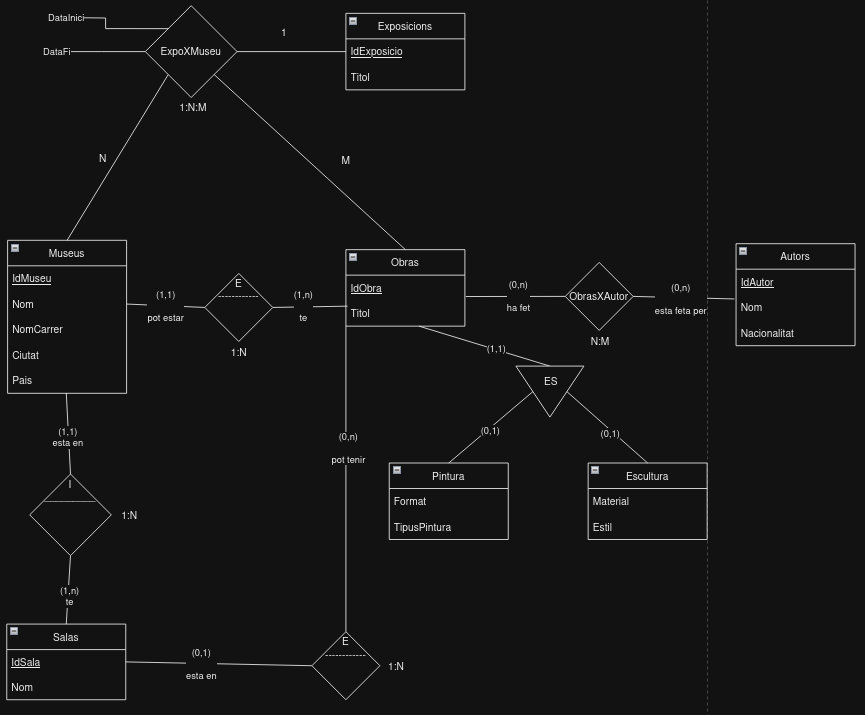

# 6. Museus

Una persona amant de l'art vol construir una base de dades de museus del món i les obres d'art de cadascú. Per les limitacions del seu equip informàtic (i les seves pròpies) va considerar únicament pintures i escultures.

Per la informació de què disposa, pot saber en quin museu està cada obra d'art i, a més es coneix la sala del museu en la qual està l'obra. Les sales dels museus tenen un nom i pot haver sales amb mateix nom en diferents museus.
Com a aficionat a la matèria que és, sap que tota obra d'art té un títol.

Altres dades són específics del tipus d'obra d'art que consideri: pintura o escultura. Així, de les pintures es coneix el seu format de anchoxalto i el tipus de pintura (oli, pastel, aquarel·la, ...). 

De les escultures es considera el material amb què estan fetes (bronze, ferro, marbre, ...) i l'estil de l'escultura (neoclàssica, grecoromana, cubista, ...).

Li interessarà també, conèixer els autors de les obres. Les dades generals dels autors seran el seu nom i nacionalitat. Com és natural, hi ha obres d'art de les que es desconeix l'autor.

Dels museus recollirà la següent informació: el nom del museu, direcció amb el nom del carrer i el número, a més de la ciutat i el país on està.
D'algunes obres d'art no es coneix la sala, només el museu.

Hi ha exposicions itinerants, composades per obres d'altres museus que es presten temporalment a un museu concret. Aquestes exposicions recorren el mon i van de museu en museu. Es vol recollir el títol de l'exposició, la data d'inici, la data de fi, per quin museu ha passat i quines obren la conformen.
Nota: establiu les claus primàries que considereu oportunes.

# 2. Model conceptual
## 2.1. Enllaç públic a l'esquema
[Esquema drawio -- Museus](https://drive.google.com/file/d/1T8_mFhSECk8txdo_-Lia6A0e0rLjbgk4/view?usp=sharing)
## 2.2. Esquema conceptual (EC ó ER)
  
# 3. Model lògic relacional
## 3.1. Esquema lògic

Obra (<ins>IdObra</ins>, tipus, format, TipusPintura, Material, estil, *IdMuseu,Idsala*)\
Museu (<ins>IdMuseu</ins>, Nom, NomCarrer, Ciutat, Pais)\
Salas (<ins>IdSala,IdMuseu</ins>, Nom)\
Autor (<ins>IdAutor</ins>, Nom, Nacionalitat)\
Exposicio (<ins>IdExposicio</ins>, Titol)\
AutorXObra (<ins>IdObra,IdAutor</ins>)\
ExpoXMuseu (<ins>IdObra,IdMuseu</ins>, *IdExposicio*, DataInici, DataFi)   

## 3.2. Diagrama referencial

* El diagrama referencial em serveix per indicar quines claus alienes hi ha a l'esquema lògic  
* La relació referencial és aquella que conté la clau aliena  
* La relació referida és l'origen de la informació. És la part 1, tal com s'ha explicat a classe.

Relació referencial|Clau aliena|Relació referida
-|:-:|-
Sala|IdMuseu|Museus
Obra|IdMuseu,IdSala|Salas
AutorXObra|IdObra|Obras
AutorXObra|IdAutor|Autors
ExpoXMuseu|IdMuseu|Museu
ExpoXMuseu|IdObra|Obra
ExpoXMuseu|IdExposicio|Exposicions

# 4. Model físic
## 4.1 Enllaç a l'esquema físic

[NONE](./)