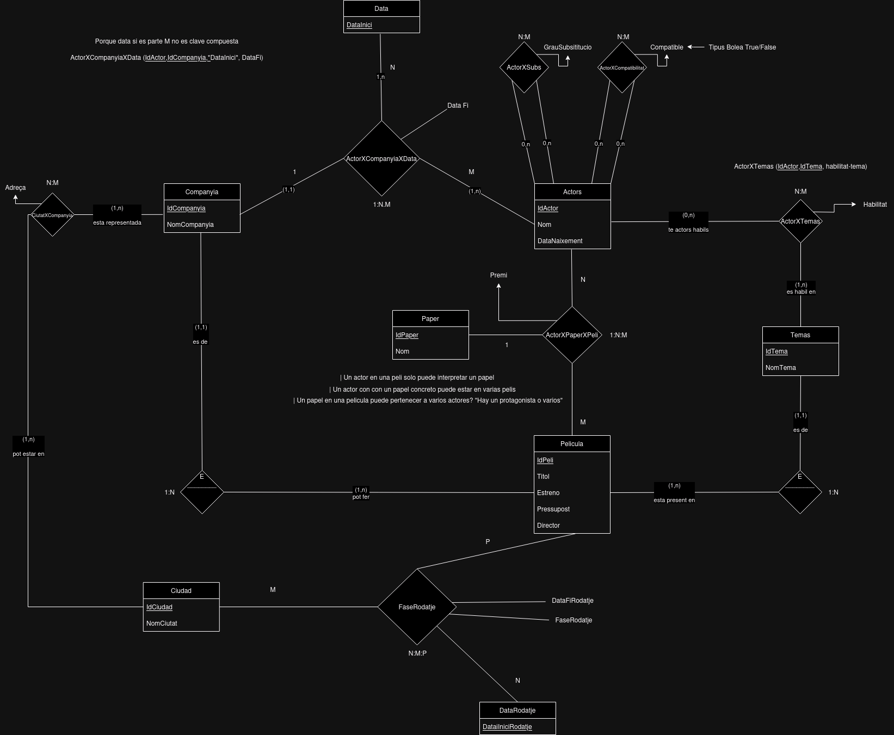

# 7. El cinèfil

Un cinèfil aficionat a la informàtica vol crear una Base de Dades que reculli informació diversa sobre el món cinematogràfic, des dels orígens del cinema fins a avui mateix, amb el contingut que es descriu a continuació.
Lògicament, vol tenir classificades moltes pel.lícules, que vindran identificades per un codi. També vol de cadascuna el nom, l’any de l’estrena, el pressupost, el director, etc. A més, de cada pel.lícula vol conéixer també quins actors van intervenir, així com el paper que hi representàven (actor principal, secundari, etc.) i el possible premi que va rebre per la seva interpretació.
Les pel.lícules són d’un tema determinat. Es ben sabut que hi ha actors especialitzats en un tema, encara que un actor és capaç d’interpretar varis temes amb diferent “habilitat”.
Com que el nostre cinèfil és una mica curiós, vol emmagatzemar també dades personals dels actors, que ha anat recollint al llegir revistes del món artístic. Per exemple, quins actors són en certa manera substitutius d’altres, amb un grau de possible substitució que pot anar de 1 a 10. També quins actors són “incompatibles”, o sigui, que mai han treballat ni treballaran junts amb una mateixa pel.lícula o escena.

Els actors estan contractats, en un moment donat per una companyia, però poden canviar si tenen una oferta millor. També poden retornar a una companyia en la que ja hi  havien treballat. Les companyies produeixen pel.lícules, però cap pel.lícula és coproduïda per dues o més companyies.
Com que el nostre amic fa molt de turisme, vol saber, per a cada ciutat, quines companyies hi tenen representació i a quina adreça. Evidentment, les companyies solen tenir representació a quasi totes les ciutats importants. Al mateix temps, vol també informació de quines pel.lícules s’estan rodant a cada ciutat i en quin moment, tenint en compte que una pel.lícula es pot rodar a vàries ciutats i també a una mateixa ciutat en diferents fases del seu rodatge.
Qüestions

Proposeu un esquema entitat-relació per a la BD en qüestió. Identifiqueu clarament entitats, atributs i relacions.
Proposeu un esquema lògic relacional equivalent amb el seu corresponent diagrama referencial.

# 2. Model conceptual
## 2.1. Enllaç públic a l'esquema
[Esquema drawio -- Cinefil](https://drive.google.com/file/d/1xJneZI2XctXEwiyj9ojGl516TRhDMXZy/view?usp=sharing)
## 2.2. Esquema conceptual (EC ó ER)
  
# 3. Model lògic relacional
## 3.1. Esquema lògic

Pelicula (<ins>IdPeli</ins>, Titol, Estreno, Pressupost, Director, *IdCompanyia*, *IdTema*)\
Tema (<ins>IdTema</ins>, NomTema)\
ActorXTema (<ins>IdActor,IdTema</ins>, HabilitatTema)\
Companyia (<ins>IdCompanyia</ins>, NomCompanyia)\
Ciutat (<ins>IdCiutat</ins>, NomCiutat)\
CiutatXCompanyia (<ins>IdCiutat,IdCompanyia</ins> Adreça)\
Paper (<ins>IdPaper</ins>, Nom)\
Actor (<ins>IdActor</ins>, Nom, DataNaixement)\
ActorXSubstitucio (<ins>IdActor1,IdActor2</ins>, GrauSubstitucio)\
ActorXCompatibilitat (<ins>IdActor1,IdActor2</ins>, Compatible)\
Data (<ins>DataInici</ins>)\
ActorXCompanyiaXData (<ins>IdActor,DataInici</ins>, *IdCompanyia*, DataFi)\
ActorXPaperXPeli (<ins>IdActor,IdPeli</ins>, *IdPaper*, premi)\
DataRodatge (<ins>DataIniciRodatge</ins>)\
FaseRodatge (<ins>IdPeli,IdCiutat,DataIniciRodatge</ins>, FaseRodatge DataFiRodatge)

## 3.2. Diagrama referencial

* El diagrama referencial em serveix per indicar quines claus alienes hi ha a l'esquema lògic  
* La relació referencial és aquella que conté la clau aliena  
* La relació referida és l'origen de la informació. És la part 1, tal com s'ha explicat a classe.

Relació referencial|Clau aliena|Relació referida
-|:-:|-
Pelicula|ID Companyia| Companyia
Pelicula|ID Tema|Tema
ActorXTema|ID Actor|Actor
ActorXTema|ID Tema|Tema
CiutatXCompanyia|ID Ciutat|Ciutat
CiutatXCompanyia|ID Companyia| Companyia
ActorXSubstitucio|IdActor1|Actor
ActorXSubstitucio|IdActor2|Actor
ActorXCompatibilitat|IdActor1|Actor
ActorXCompatibilitat|IdActor2|Actor
ActorXCompanyiaXData|IdActor|Actor
ActorXCompanyiaXData|IdCompanyia|Companyia
ActorXCompanyiaXData|DataInici|Data
ActorXPaperXPeli|IdActor|Actor
ActorXPaperXPeli|IdPelicula|Pelicula
ActorXPaperXPeli|IdPaper|Paper
FaseRodatge|IdPeli|Pelicula
FaseRodatge|IdCiutat|Ciutat
FaseRodatge|DataIniciRodatge|DataRodatge

# 4. Model físic
## 4.1 Enllaç a l'esquema físic

[NONE](./)